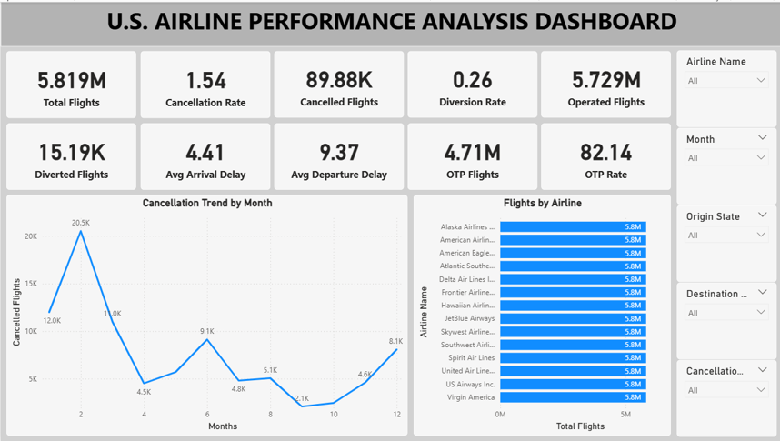
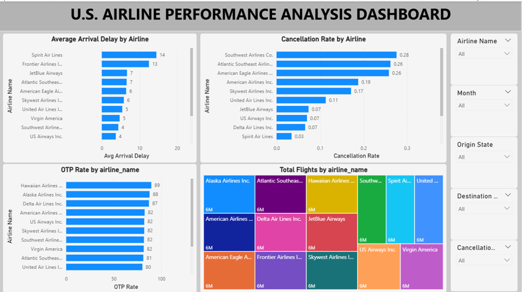
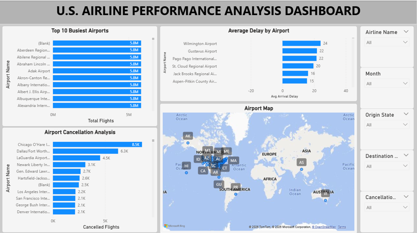
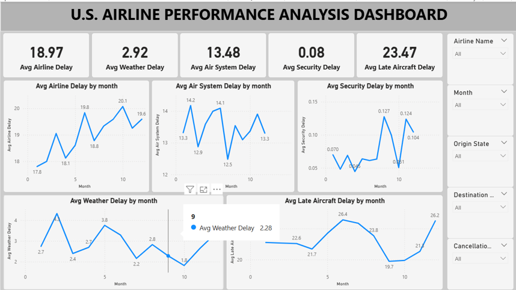
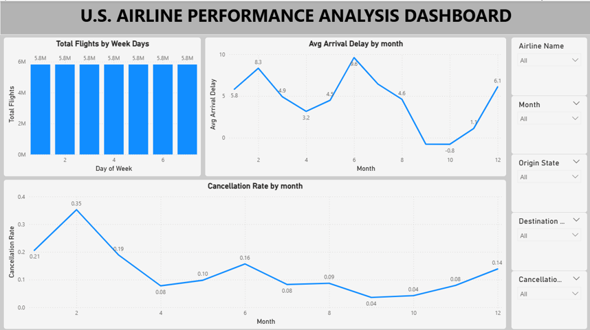

# ✈️ Fly Emirates Flight Performance & Delay Analysis

## 📌 Project Overview

This project analyzes historical flight data to identify patterns in airline performance, flight delays, cancellations, and operational efficiency. The analysis was performed using SQL for data processing and Power BI for interactive dashboard development, providing valuable insights into airline operations and customer service performance.

The project demonstrates the complete data analytics workflow, including data cleaning, SQL querying, KPI development, dashboard creation, and business insight generation.

---

## 🎯 Objectives

- Analyze flight performance and operational efficiency.
- Identify major causes of flight delays.
- Measure on-time performance (OTP) across airlines.
- Analyze cancellation trends and cancellation reasons.
- Build interactive dashboards for business decision-making.

---

# 🛠️ Tools & Technologies

- **Power BI**
- **SQL (MySQL)**
- **Microsoft Excel**
- **DAX**
- **Power Query**

---

# 📂 Dataset Information

The project uses historical airline flight data containing millions of flight records.

**Included datasets**
- airlines.csv
- airports.csv

> **Note:** The complete `flights.csv` dataset and Power BI (.pbix) file are not included because they exceed GitHub's file size limits.

---

# 📊 Dashboard Features

The Power BI dashboard includes:

- Executive Summary
- Airline Performance Analysis
- Flight Delay Analysis
- Cancellation Analysis
- Monthly Trend Analysis
- KPI Dashboard

---

# 📈 Key Performance Indicators (KPIs)

- Total Flights
- On-Time Performance (OTP)
- Cancellation Rate
- Average Arrival Delay
- Average Departure Delay
- Airline-wise Performance
- Delay Cause Distribution
- Monthly Flight Trends

---

# 📷 Dashboard Preview

## Dashboard Overview



## Flight Delay Analysis



## Airline Performance



## Cancellation Analysis



## Monthly Trends



---

# 📁 Repository Structure

```
Fly_Emirates_Flight_Project
│
├── README.md
├── Fly_Emirates_Report.pdf
├── Fly_emirates_ppt.pptx
├── Fly_Emirates_sql_queries.sql
├── airlines.csv
├── airports.csv
├── Dashboard_page_1.png
├── Dashboard_page_2.png
├── Dashboard_page_3.png
├── Dashboard_page_4.png
└── Dashboard_page_5.png
```

---

# 📄 Project Documentation

The repository includes:

- Detailed Project Report (PDF)
- PowerPoint Presentation
- SQL Queries
- Dashboard Screenshots

---

# 💡 Business Insights

The analysis provides insights into:

- Airlines with the best on-time performance.
- Major causes contributing to flight delays.
- Monthly and seasonal delay trends.
- Cancellation patterns across airlines.
- Operational performance comparison between airlines.
- Opportunities for improving airline efficiency and customer satisfaction.

---

# 🚀 Future Improvements

- Integration with live flight APIs.
- Predictive delay analysis using Machine Learning.
- Real-time Power BI dashboard.
- Advanced forecasting using Python.

---

# 👨‍💻 Author

**Peritosh Sinha**

Aspiring Data Analyst

- **LinkedIn:** https://www.linkedin.com/in/peritosh-sinha
- **GitHub:** https://github.com/Peritosh

---
